# Trivy Operator Dashboard Documentation

## Trivy Reports

Trivy Reports can be seen in three ways: Overview mode (in Home), 
Inspect mode (Browse) and Detailed. Each is described in detail below.

> **Note:** All examples in this documentation are from Vulnerability Reports pages, as all Trivy Reports related pages are similar as layout and functionalities, with one big exception, SBOM Reports.

### Home - Overview mode

It is the "at-a-glance" page, where various statistics related to Trivy Reports can be seen.

On the left are some tables related to various statistics **(1)**, and on the right (where applicable) are some graphs **(2)** to give an idea how they stand.

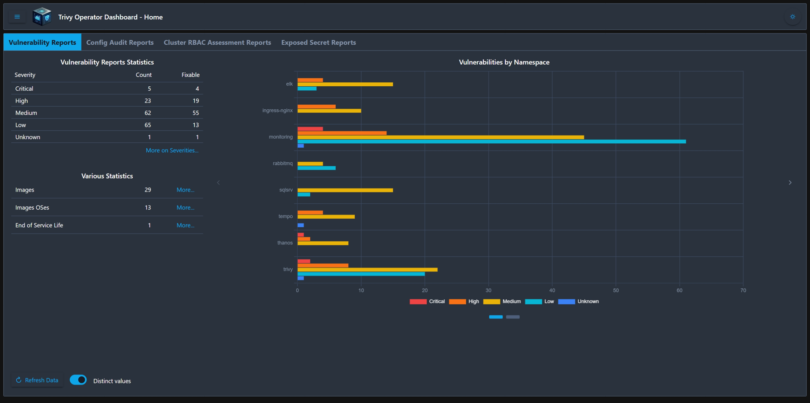
 *Main Overview page*

Also, some other info can be seen here, by pressing the `More` buttons **(3)**.

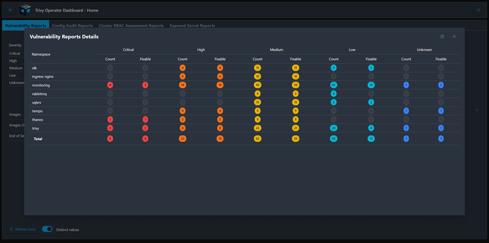
 *More on Severities*

The `Refresh Data` button **(4)** reloads data from the backend.

The `Distinct values` **(5)** groups identical values in order to provide a clearer understanding of the reports; i.e. in Vulnerability Reports Statistics, severities are shown as distinct (unique) values, which means that if the same Vulnerability is found in many containers, it will be counted as one.

### Inspect mode (Browse)

The layout is a classic master **(1)** - details **(2)** one. This page groups reports to simplify inspection, if needed. Between the two tables, there is a splitter **(3)**, that allows fast changing of their ratio/size.

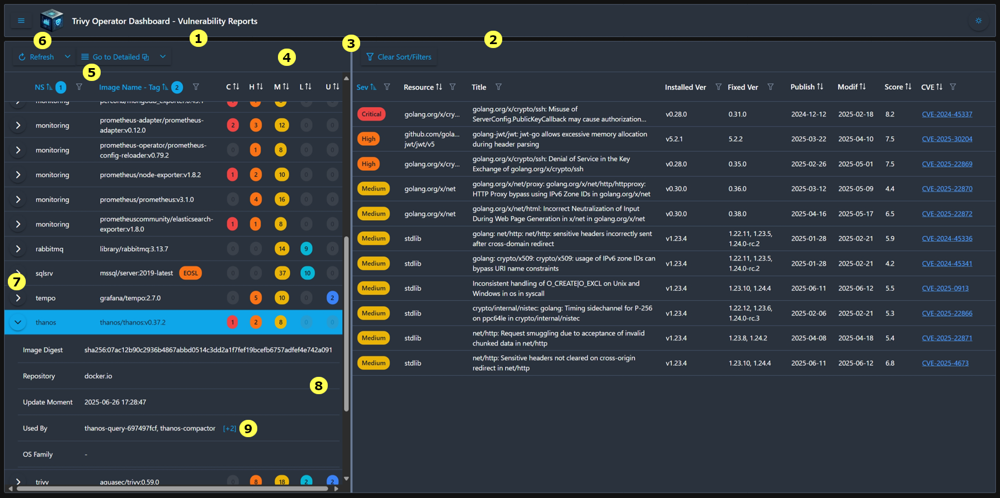
 *Inspect (browse) page*

In all tables you can find various action buttons **(4)**, most of the columns can be filtered and sorted **(5)**.  If **(6)** is a Split Button, then the popup can be used to filter the data directly from the server. This can be useful, as an example, if you're a developer and want to view only severities that are Critical, High and Medium from a specific namespace.

 *Server-side filter*

Also, most of the **Inspect mode (Browse)** pages have a **Multi action** button, which provides access to various Trivy Report–specific actions, beside standard ones, like `Clear sort/filters` or `Collapse all`. As an example, in the case of Vulnerability Reports, as specific actions, we have `Go to Detailed`, `Dependency tree` and `Compare`.

> **Note:** A '⧉' icon next to a menu item indicates that the action will open in a new browser tab.

Depending on the case, some tables support row expansion **(7)**, if more info can be displayed **(8)**. In the case of Vulnerability Reports, identical images are grouped to avoid duplication, and their usage by Replicasets, Statefulsets, Jobs etc. can be seen by accessing **(9)**.

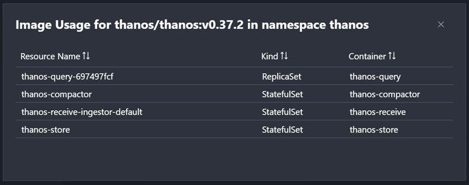
 *Image usage in namespace*

### Detailed

In this mode, all data is denormalized in a single large table, with all info from Reports. Filtering, sorting and CSV export are available. This view is ideal when data needs to be accessed or used outside the application.

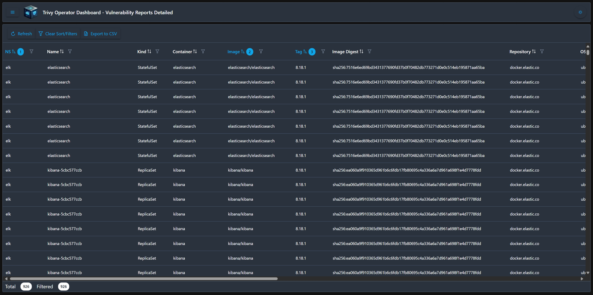
 *Detailed page*

### Compare Trivy Reports

If needed, two Trivy Reports can be compared to quickly identify differences. The comparison is performed by displaying report details side by side and using compound keys for existence-based comparison. For example, in Vulnerability Reports, the comparison key includes the CVE, the associated Resource, and its version.

 *Vulnerability Reports Compare page*

The items belonging to **(1)** will appear as `True` in the `1st` column **(3)**, and those from **(2)** will appear in the `2nd` column **(4)**. An important detail to note is that if there are differences in values - such as the Installed Version in Vulnerability Reports - they will be displayed stacked for clarity **(5)**. Additionally, there are cases where the same item appears multiple times within a single Trivy Report (e.g., the same component listed with different versions). These versions will also be shown, stacked if necessary. A good example can be seen in SBOM Compare **(6)**, where the same component has multiple versions.

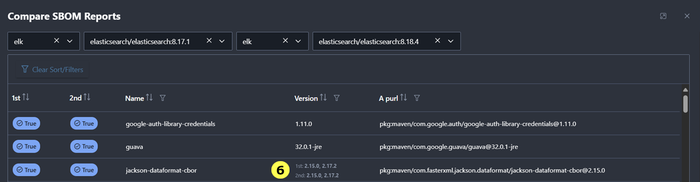
 *SBOM Reports Compare page*

### Trivy Reports Dependency

To get an "at-a-glance" view of all Trivy Reports related to an image within a namespace, you can use Trivy Reports Dependency. This view allows easy navigation to specific Trivy Reports using the `Open` button.

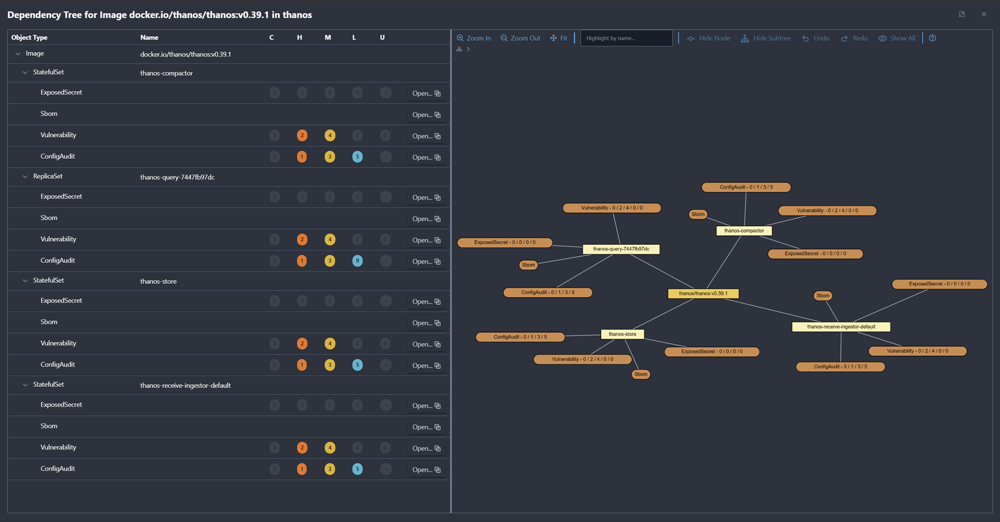
 *Trivy Reports Dependency page*

> Note: Since the dependency tree is centered around the container image, it is accessible from Vulnerability Reports, Exposed Secrets Reports, and SBOM Reports. However, it is not available from Config Audit Reports, as a single audit report may be associated with a resource (e.g., a ReplicaSet) that includes multiple containers - and therefore, multiple images.

## SBOM Reports

Unlike other reports, SBOM Reports are not well-suited for a simple master-detail view. Due to their structure, they are more effectively displayed as a table **(1)** and a graph **(2)**.

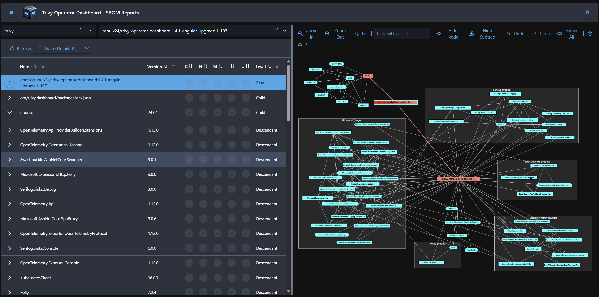
 *SBOM page*

The table includes Image selection **(3)**, `Refresh` button **(4)**, Multi action button **(5)** and the list of BomRefs - for any of them, properties can be visualized **(6)**. Whenever possible, info from related Vulnerability Report is provided also here.

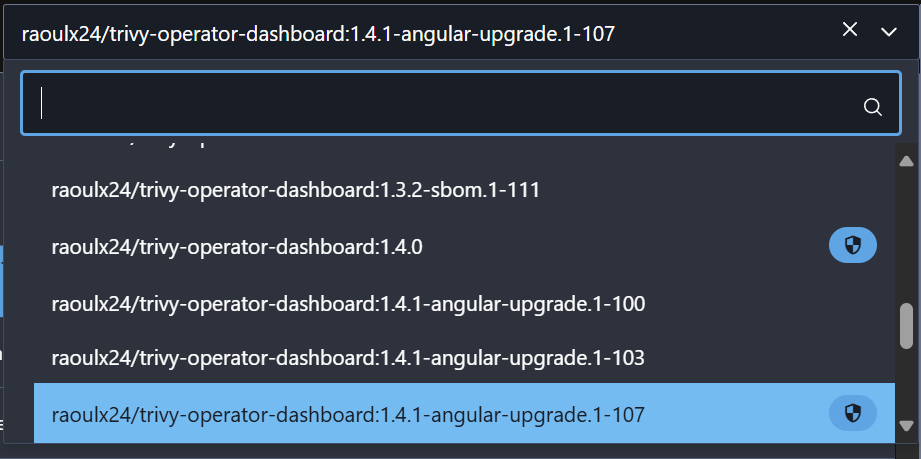
 *Image Selection **(3)*** - The shield icon next to the image name indicates that a Vulnerability Report is also available

**Multi action** button contains many useful actions. Specific to SBOM:
- `Info` will display an in-depth information page. See *Info page* below
- `Dive In` will change the current root element in table and in graph (with redraw)
- `Export to CycloneDX` (XML or JSON) and `Export to SPDX` (JSON)

> **Note:** SBOMs can be exported in CycloneDX format (XML and JSON) on both the Inspect/Browse and Detailed/Denormalized pages (bulk export). SPDX format (JSON) is available only on the Inspect/Browse page and is currently experimental.

### Info Page

It has 4 sections:
- SBOM and Vulnerabilities (if available)
- Image usage info
- License usage per component
- A BomRef property pivot displayed as a tree structure, showing each Property Name, its corresponding Values, and the BomRefs associated with those values

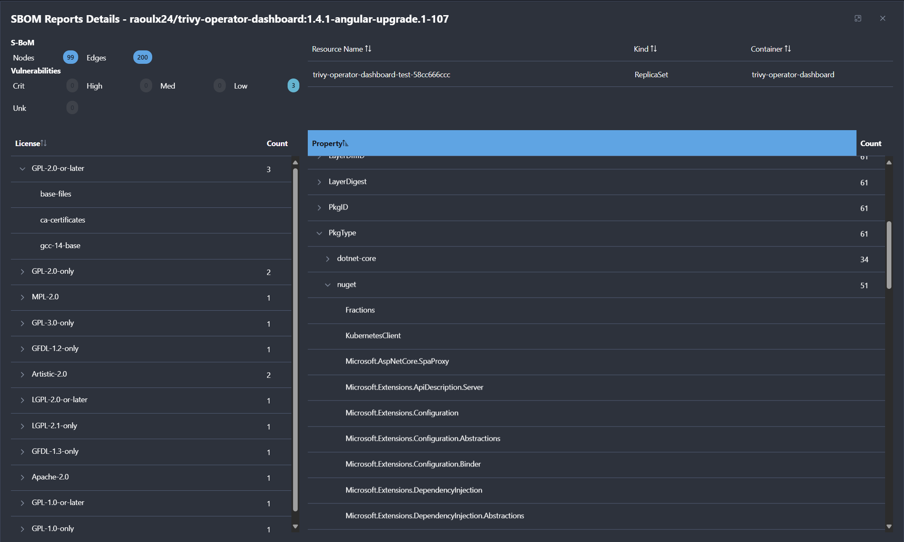
 *SBOM Info Page*

### Graph

It consists of 3 sections:

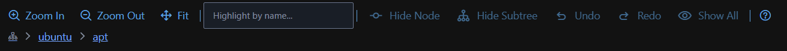
 *SBOM Graph*
1. Toolbar. Here, various actions can be performed over the graph:
    - `Zoom In`, `Zoom Out` and `Fit` - These actions are self-explanatory
    - search for nodes by a string in their name
    - "edit" part of the graph. More info a bit down, in *Interaction with Graph* 
2. Navigation - History of **Dive In** actions performed on the graph. A **Dive in** action is drawing only the part of the graph that contains the descendants (direct or indirect) of the selected node that becomes the new root
3. The graph. A synthetic graph is as follows:

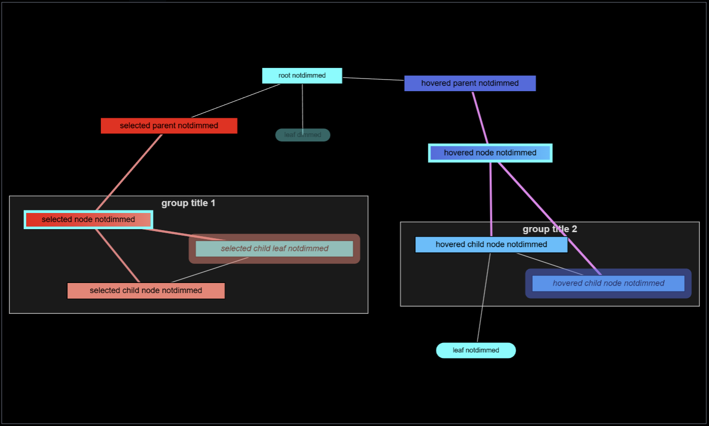
 *SBOM Graph*

#### Colors

- **Red** - Selected node and adjacent nodes (neighbors)
- **Blue** - Hovered node and adjacent nodes (neighbors)
- **Gray** - Group of nodes. It appears slightly transparent.
- **Other colors** - Nodes with specific roles. Non-white colors signal functional distinctions

#### Shapes

- **Rectangle** - Nodes with children
- **Rounded Rectangle** - Leaf nodes (nodes without children)
- **Container with nodes** - A container that groups nodes. Usually, it is based on something similar to namespaces or package repositories

#### Color Intensity

- **Darker (red or blue)** - Parent of selected/hovered node
- **Lighter (red or blue)** - Child of selected/hovered node
- **Gradient (red or blue)** - Selected/hovered node. These nodes are also emphasized using a strong contrasting border
- **Haloed (red or blue)** - Circular reference. Those nodes also depend on selected/hovered node
- **Dimmed** - Unhighlighted Nodes. Their names do not include the searched term

#### Interaction with Graph

- **Click** - Select a node. Any previously selected nodes will be deselected
- **Ctrl + Click** - Select additional nodes
- **Ctrl + Mouse Drag** - If dragging starts in empty space, all nodes within the selection range will be selected
- **Dbl Click** - Dive into the graph. The clicked node becomes the new root; only its descendants (of any kind) and direct parents will be displayed 
- **Hide Node** - The selected node will be hidden. If orphans remain (nodes with no parents or children), they will also be hidden
- **Hide Subtree** - The selected node and all its direct descendants will be hidden. If orphans remain (nodes with no parents or children), they will also be hidden

## Others

### Watchers Status

The backend uses Kubernetes Watchers to get the changes in real-time. Their states (running, errors) can be seen here with remediation solutions.

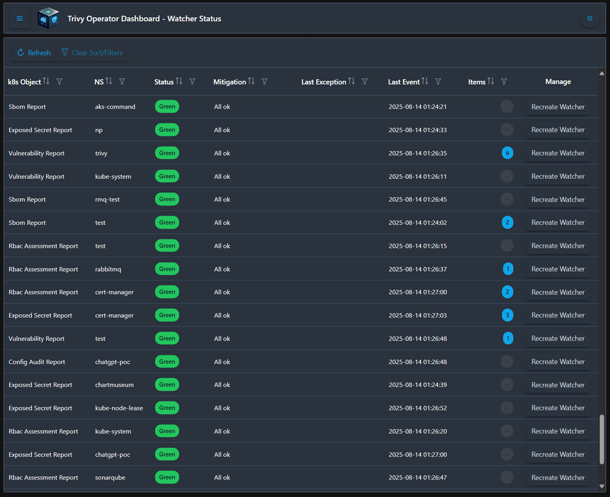
 *Watcher Status*

> **Notes:**
> - If any watcher is in an error state, an alert will be triggered, and a Notification Bell appears in the top menu bar
> - Although watchers are monitored by a Watchdog, they can be forcefully recreated from this interface if necessary, as a last resort

### Alerts

If any alerts are triggered, you can access them by clicking the Notification Bell in the top menu bar. Alerts are organized in a tree format **(1)**, beginning with their severity level, issuer, and subsequent hierarchy levels. Each line includes a count **(5)**, and levels can also be expanded or collapsed using control **(2)**. For **Info**

- when a node is expanded, but it is not a leaf **(3)**, only the categories and their counts are shown.
- when a node is collapsed **(4)**, all children and categories with their respective counts are displayed in a stacked view.
- when a node is a leaf **(5)**, the actual alert message and its category are displayed, also stacked.

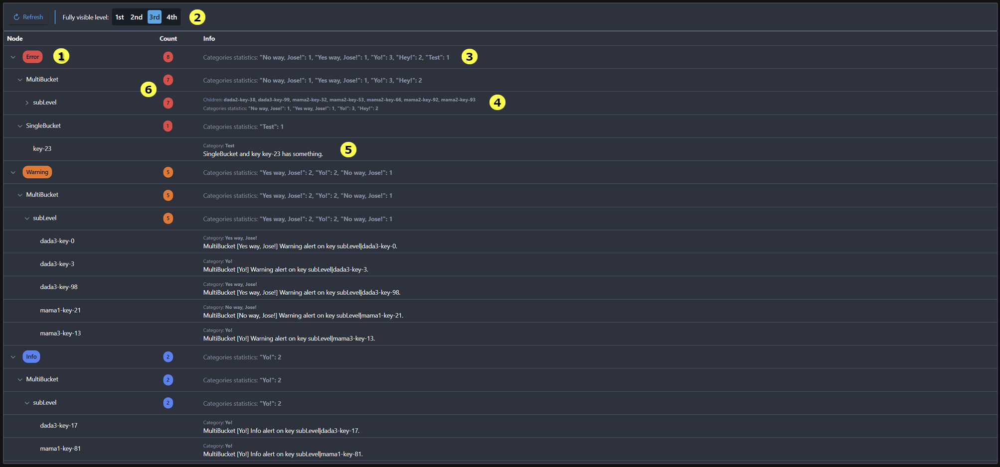
 *Alerts*

> **Note:** The above image displays synthetic data generated for illustrative purposes.

### Settings

It consists of four main sections:
- Table States - all tables from the app persist their states (column order and size, sorts, filters etc.). Here you can clear the saved state as needed.
- CSV File Names - all file names used for exports to CSV are persisted. If you wish to change their defaults, here it is the place to do it
- Trivy Reports States - here sections related to a Trivy Report can be (in)activated in the frontend (i.e. there is no need to use Config Audit Reports). Also, if inactivated in the backend, it will also be reflected here.
- Display Settings - here you can choose how the severities count are displayed. You can also preview your selection

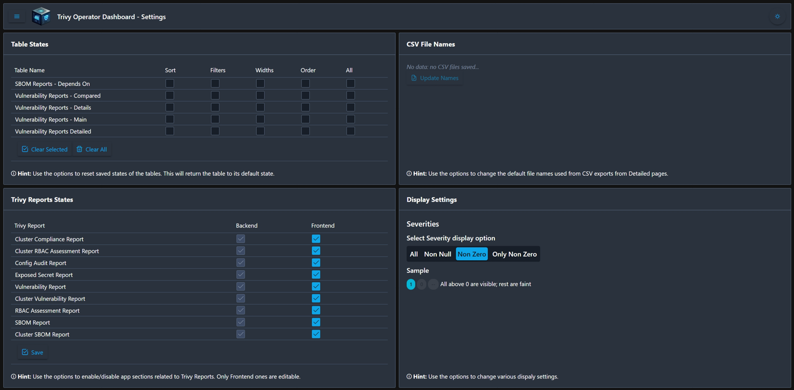
 *Settings Page*

### About

The page provides essential information about the app, including version details, release notes, and acknowledgments.

**Version Check** allows users to see their current version and whether an update is available.

**Release Notes** document recent updates, including improvements and bug fixes.

**Credits** lists the technologies and frameworks that support the app.

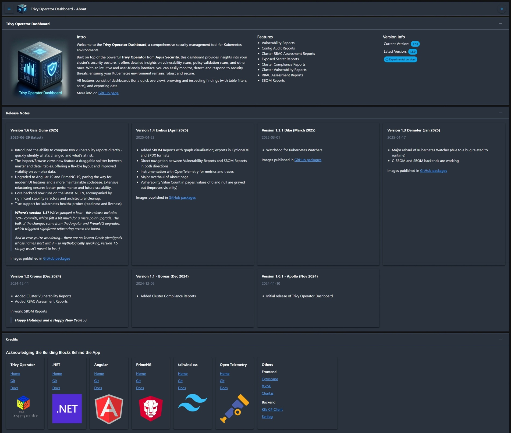
 *About Page*

### Dark/Light Mode

The application fully supports Dark/Light mode. It can be switched on the fly at any desired moment and persists between sessions. By default, the application uses the mode provided by the browser/system.

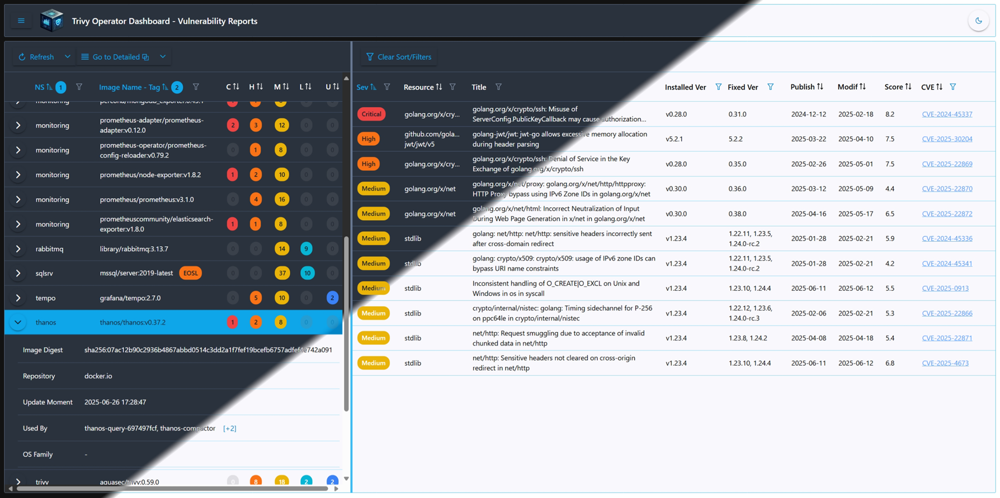
 *Dark/Light Mode*